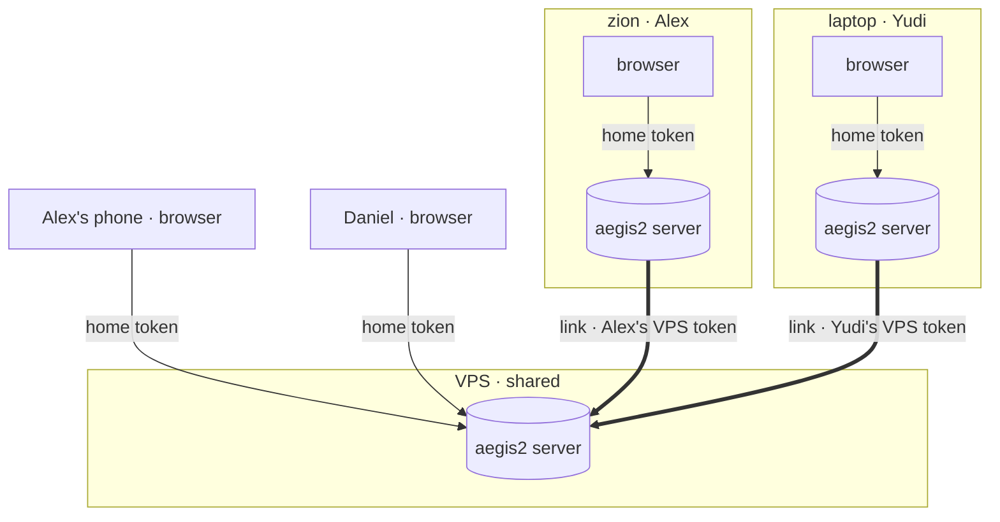
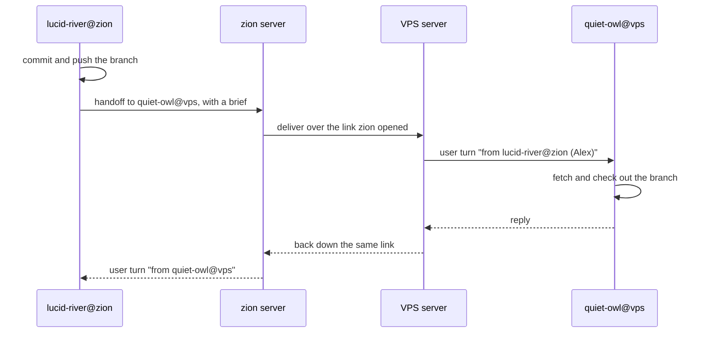
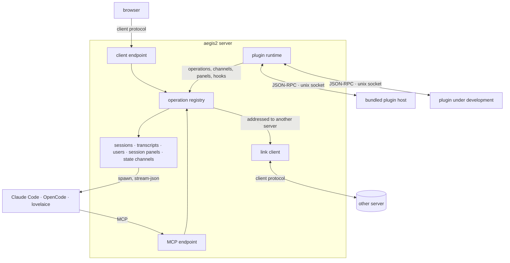
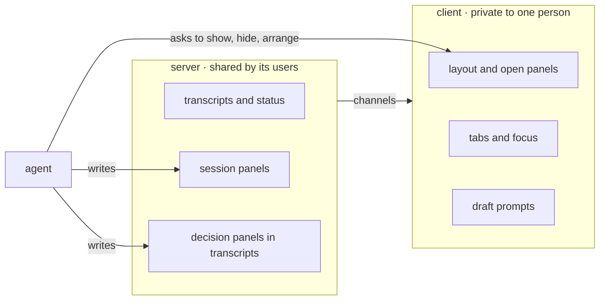
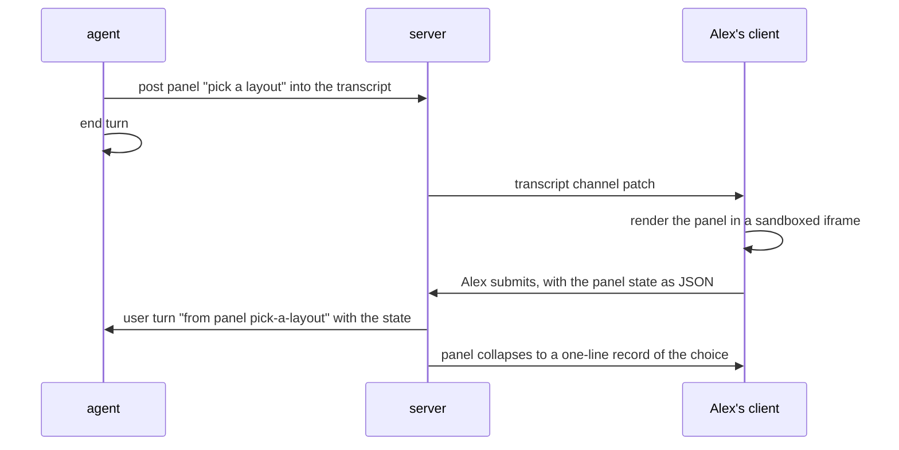
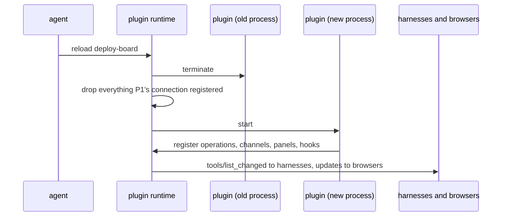

# aegis2: vision

**Status: draft vision, 2026-10-05.** Agreed with Alex in one conversation;
nothing is built. This is the top-level picture that later specs hang from: the
server core and its protocols, the web client, the plugin runtime, cross-server
links, and the migration. Each of those gets its own spec when its slice comes up.

It sets a new direction for aegis2 and leaves the current aegis as it is. The
current tree follows `2026-09-07-retire-web-ui-tui-over-web-design.md` (one
brain, many TUI views); aegis2 does not. It takes ideas 1 to 3 from
`2026-08-23-aegis-plugin-first-core-vision.md` and drops idea 5.

## Why a second aegis

Four things the current aegis cannot do.

1. **The agent cannot change the harness it runs in.** Alex wants an agent to
   show and hide panels, write new ones and read them back, so it can hand him
   a UI for a design choice or a decision. In aegis a view is a Textual app
   running inside the daemon. Agent-written UI would be Python executing in the
   process that holds every session, and one duplicate widget id takes the
   whole app down (DESIGN.md, "One authority for handle names"). A browser
   loads a new script without a restart, and a broken panel breaks only its
   own iframe.
2. **A terminal cannot draw what agents produce.** Images, PDFs, diagrams,
   math, diffs and forms. `aegis web` relays Textual's ANSI frames to xterm.js
   (`src/aegis/webterm/`, about 1,000 lines), so the browser view has the same
   limits as the TUI.
3. **One user, one server.** Alex, Yudi and Daniel each want their own local
   aegis plus a shared one on the VPS, where they schedule work and watch long
   runs. Zion and the phone should see the same VPS sessions.
4. **Plugins need a restart.** Python cannot unload a module cleanly, which is
   why the August vision called live plugin loading "not a small piece of
   work".

Doing all four inside the current tree would touch nearly every module and keep
`main` working through dozens of intermediate states. aegis2 is built from
scratch next to it instead ("How we build it" below).

## What aegis2 is

aegis2 is a shared workplace for a small team and their coding agents. Each
person runs a server on the machine where they work. A shared server on the VPS
is where the team schedules tasks and watches long-running work. The browser
talks to one server, its home server, which proxies every other server the user
holds a token for. Agents run inside existing harnesses (Claude Code, OpenCode,
lovelaice). aegis2 runs them, lets them talk to each other across servers, and
lets them reshape the UI and extend the server while they work.

It is for Alex, Yudi and Daniel first. It stays publishable on PyPI, but its
protocols are internal until they settle, so we break them freely, and its docs
are written for agents, not strangers.

## Topology

- **A server per working machine.** A server runs harness sessions, stores
  transcripts and status, runs plugins and serves the client app.
- **One shared server.** The VPS server holds the team's scheduled and
  long-running work. Each person holds a token for it.
- **The home server.** The browser talks to exactly one server: `localhost` on
  zion, the VPS on the phone. The home server holds the user's tokens for other
  servers and proxies them. The browser holds one token, for home, and never
  sees the others.
- **Links.** A home server keeps one outbound connection open to each server it
  proxies. That connection is a link. Messages and handoffs between agents on
  the two servers travel over it, so they arrive with no browser open.
- **The reachability rule.** The side that can reach the other opens the
  connection. Zion reaches the VPS; nothing reaches into a laptop. Messages from
  the VPS to zion travel down the connection zion opened.
- **Direct links only.** An agent sees agents on its own server and on the
  servers its server links to. The VPS does not relay between its links, so
  Alex's local agents and Yudi's local agents cannot talk unless one server
  links to the other. Relaying can come later if it is missed.
- **No local server needed.** Daniel can use the VPS as home from a browser.

### Addressing

A session's address is `handle@server`, for example `quiet-owl@vps`. A bare
handle means the caller's own server. Each server has one canonical name that it
announces over a link, so an address means the same thing to every user.
Messages, handoffs, `read_peer` and operator commands all take addresses:
`/spawn opus@vps implement this plan` typed in a zion client spawns on the VPS.

## Users and the security model

A server knows its users by token. Every action records the user behind it: who
started a session, who typed a prompt, who scheduled a job. Transcripts and
status are shared, so Alex on zion, Alex on the phone and Yudi see the same VPS
session in the same state.

**People can do anything** on a server they hold a token for, including closing
someone else's session. Read-only and append-only tokens come when someone
needs them.

**An agent reads and messages anything it can see, and changes only what it
created.**

| What an agent does | Own server | Linked server |
|---|---|---|
| List sessions, read transcripts | yes | yes |
| Message, hand off | yes | yes |
| Spawn | yes | no |
| Close, cancel, edit | only what it created | no |
| Claim files | yes | no: a claim names a file on one machine |

- **People cross servers; agents ask.** `/spawn x@vps` from a client works
  because a person issued it. An agent on zion that wants work done on the VPS
  hands it to an agent living there, such as a standing dispatcher session,
  and that agent decides whether to spawn. Today's server-to-server enqueue
  (`src/aegis/remote/`) has no equivalent.
- **Messages carry provenance.** A message from another server names the
  sender's handle, server and user in its header, so the receiving agent can
  tell Daniel's agent from Alex.
- **The panel sandbox is a security boundary.** A panel written by an agent
  working for Yudi renders in Alex's browser. The iframe sandbox keeps it from
  the page, the page's storage and the home token. Tokens for other servers
  never reach the browser.
- **Plugins are trusted code.** A Python plugin runs as the server's OS user,
  like any agent's Bash. Its separate process contains crashes and makes reload
  possible; it is not a security boundary. Installing a plugin on the VPS
  affects every user of the VPS.

## Moving work between servers

Work moves by handoff. The receiving session starts on the target server from a
brief; the code travels by git.

- aegis2 delivers the message and records its provenance. Fetching the repo,
  checking out the branch and reading the brief are the receiving agent's job,
  taught by skills.
- Session transfer, moving the transcript and the harness's own session file,
  is deferred. The harness session file records paths from the source machine,
  so resuming it elsewhere is fragile. Build it only if handoffs turn out to
  lose too much context.

## The server

The core holds what it takes to run a session, see it and talk to it, across
users and servers:

- **Sessions and harness drivers.** Spawn, stream, interrupt, resume.
- **The transcript store and status.** Each entry carries its user.
- **The operation registry.** Every action in the system is one registered
  operation with a schema. MCP tools for agents and client actions for browsers
  are two projections of it. Plugins add operations to it.
- **State channels.** Server state a client renders is published as named
  channels: a snapshot on subscribe, then patches. A plugin that adds state
  adds a channel.
- **Users and tokens.**
- **The link client.** The home server's connection to each server it proxies.
- **The plugin runtime.**
- **Session panels.** Panels attached to sessions, stored with them.
- **Config and the model registry.** The status line shows context use and
  cost, which needs context windows and prices.
- **Operation descriptors.** The glyph and one-line summary each operation
  renders as in a transcript, resolved once in Python (DESIGN.md, "One table
  per fact that crosses the wire").

Each party speaks one protocol. Agents speak MCP. Browsers and links speak the
client protocol. Plugins speak the plugin protocol. Panels speak postMessage to
their host page.

### Why this protocol should not rot

The September spec retired a JavaScript client because it spoke a protocol in
which every subsystem needed its own fields, and 18 subsystems never got them.
Two rules answer that:

1. **One registry, every caller.** Anything an agent can do, a person can do
   from the client, and the reverse, because both call the same registered
   operation. A subsystem cannot exist for agents and be missing from the UI.
2. **The client knows no subsystem by name.** It renders the session list,
   transcripts, the layout and panels. A subsystem's UI is a panel its plugin
   ships. Adding a subsystem adds operations, channels and panels; it changes
   no protocol field and no client code.

## The client

- **Static JavaScript, no build step.** Vendored ES modules, served by every
  server. Installed as a PWA for its own window and notifications. The phone
  runs the same app, served by the VPS.
- **No Electron.** If a need appears that a PWA cannot meet, Tauri is the first
  candidate. The only such need known today is a global push-to-talk hotkey,
  which a small helper next to the server could also cover.
- **What it renders.** The session list across servers as the home screen, tabs
  with transcripts, the prompt box, the layout and its panels, the command
  palette, themes, the file viewer, and microphone capture.

### Who owns which part of the UI

- **Session UI lives on the server and is shared.** Panels attached to a
  session and decision panels in its transcript. Everyone looking at that
  session sees them, and anyone can answer.
- **The arrangement lives with the client and is private.** Which panels are
  open, where they sit, which tab has focus, the half-written prompt.
- **Agents rearrange the UI of the people they work with.** An agent asks a
  client to show, hide or arrange panels. A client acts on requests from
  sessions its user started or has prompted, and ignores the rest. A panel
  nobody asked for arrives as a badge, not as a focus change.
- **Undo and safe mode.** Layouts and panel files are versioned, so an agent's
  change can be reverted. `?safe=1` loads the shell with no plugin panels.

### Panels

A panel is an HTML document rendered in a sandboxed iframe. It talks to its host
page by JSON-RPC over `postMessage` and calls operations through the page, never
directly. This is the shape of the MCP Apps extension (SEP-1865, specification
dated 2026-01-26). Following its message format would let aegis2 host existing
MCP Apps and let aegis2 panels run in other hosts.

A decision panel round-trips like this:

- An agent can read a panel's state at any time, so a long-lived panel works in
  both directions.
- JavaScript errors inside a panel go to the authoring agent's inbox, so it can
  fix its panel without being told.

## Plugins

A plugin contributes operations (which become MCP tools and client actions),
state channels, panels, hooks and slash commands. It can ship Python,
JavaScript panels or both. A panel-only plugin needs no process.

### Out of process, with reload

- **Disposal comes from the connection.** The runtime records each contribution
  against the connection that registered it, and drops all of it when the
  connection closes. That solves the problem the August vision called the hard
  part (unregistering everything a plugin added) without asking every plugin
  to clean up after itself.
- **A crashing plugin cannot take the server down.** The runtime restarts it.
- **A thin protocol.** JSON-RPC over a unix socket, stdlib only on the plugin
  side. The server is the only MCP server, and it projects plugin operations to
  agents. This keeps a plugin at about 10 MB and a 0.3 s start, against 41 MB
  and 1.1 s for a plugin running its own MCP server.
- **Placement is a runtime choice.** Bundled plugins share one host process.
  A plugin being edited, an agent-written plugin and a third-party plugin each
  run in their own process and reload alone. A normal day runs the server, one
  bundled host and the one to three plugins under development.
- **Lazy start.** An on-demand plugin starts on its first call and exits when
  idle.
- **Synchronous hooks are RPCs with a timeout.** A hook that approves or
  rewrites a tool call before it runs waits for the plugin's answer. The hook
  API says which hooks are synchronous. Nothing per-token crosses the socket.

### Measured cost

Measured on zion on 2026-10-05: ten copies of each profile, private memory read
from `/proc/<pid>/smaps_rollup`, cold start as the best of five.

| A plugin process that imports | Private memory | Cold start |
|---|---|---|
| stdlib only (asyncio, json) | 10 MB | 0.23 s |
| plus pydantic | 12 MB | 0.30 s |
| an aegis subsystem as written today (`aegis.queue`) | 21 MB | 0.43 s |
| the MCP Python SDK (FastMCP) | 41 MB | 1.11 s |

A JSON-RPC round trip over a unix socket took 0.22 ms. For scale, the running
aegis daemon on zion was 653 MB resident. Ten resident plugins in their own
processes would add 120 MB with the thin protocol, and 410 MB if each ran its
own MCP server. These are idle figures after imports; a plugin's in-memory state
comes on top. They were not measured on the VPS, which has 3.7 GB and no swap.

### Reaching agents

Claude Code refetches a server's tool list on `notifications/tools/list_changed`,
including in `-p` mode and the Agent SDK (Claude Code MCP documentation), so a
reloaded plugin's operations reach running Claude sessions. OpenCode and
lovelaice are unchecked. If they do not refresh, the fallback is one generic
call operation plus a discovery operation.

## What carries over from aegis

Nothing is ported in bulk. Each item arrives when a slice needs it.

| Where it goes | What |
|---|---|
| Server core, rebuilt | sessions and drivers, transcript store, config, model registry, MCP endpoint, operation descriptors, plugin runtime (today's `plugins`, `hooks`, `tools`); new: users and tokens, links, the operation registry, state channels |
| Client | session list (replaces `fleet`), layout, tabs, drafts, themes, file viewer, command palette, microphone capture |
| Bundled plugins | queue, scheduler, monitors and reminders, canvas, shared terminals, claims, workflow engine and DSL and catalog (the AFK coordinator is already a workflow), recap, digest, attention, title generation, `/btw`, `@peer`, plan strip, repos board, quota and usage, budget, repo cost, network probes, voice transcription |
| Dropped | `tui`, `daemon`, `views`, `webterm` (the web client replaces them); `remote` (links and the agent rule replace it); `hosts` (the only configured host, `vps`, becomes a server); `groups` (unused); `bench` (measures the TUI; rebuilt when a speed claim needs it); `changelog` (repo tooling, moves to `scripts/`) |

## How we build it

- **A new tree in the same repo.** `src/aegis2/`, with its own `aegis2` entry
  point in the `aegis-harness` package and the same `uv.lock`. PRs land on
  `main` as usual while aegis keeps working.
- **Copy, never import.** No file under `src/aegis2/` imports `aegis`. An AST
  test enforces it, like `tests/webterm/test_imports.py`. Leaf modules that are
  already right, such as the stream-json parsing in the drivers, the model
  registry and the glyph table, are copied and adapted.
- **Relative imports inside aegis2,** so renaming it to `aegis` at the switch is
  one mechanical commit.
- **Separate state.** Its own state root, socket path and port, so both run on
  one machine.
- **The old tree takes bug fixes only.** New features go to aegis2. Agents
  building aegis2 run inside the old aegis, so its bugs still get fixed.
- **Lessons become tests first.** Each DESIGN.md rule that cost an incident and
  still applies becomes a test before the code it constrains: transcripts are
  keyed by a log id minted at spawn, a turn boundary is not completion, replay
  does not re-record, paths resolve against explicit roots and never
  `Path.cwd()`, a damaged file never takes a session down, and what aegis says
  about a turn stays out of the agent's context.
- **Its own agent docs from day one,** covered by `.rift.yaml`, so an agent
  working in `src/aegis2/` does not read the old architecture.
- **Specs and plans on zion, implementation on the VPS.** Each slice is
  designed interactively and executed by a VPS session.
- **Switch at daily use, not at parity.** Alex moves his daily work to aegis2
  once it covers what he uses every day, and falls back to aegis for the rest.
  When nothing sends him back, aegis is deleted and aegis2 renamed.

### Slices

Each slice is usable end to end. After slice 2 the order follows need.

1. One Claude Code session, one tab, one server: spawn, stream the transcript
   to the browser, send prompts, interrupt.
2. Many sessions and tabs on one server, the session list, resume after a
   server restart.
3. Users and tokens: two browsers on one server, every action attributed.
4. Home server and links: zion proxies the VPS, the session list spans both,
   `/spawn x@vps` works.
5. Messages and handoffs across a link.
6. The plugin runtime, out of process with reload, with one subsystem moved
   over as a bundled plugin.
7. Panels: an agent writes a panel, and a decision panel round-trips to it.

Then subsystems one at a time as they are needed: scheduler, monitors and
reminders, canvas, terminals, workflows and the AFK coordinator, recap and
attention, voice.

## Non-goals

- A terminal UI.
- A server mesh, or relaying between links. Possible later.
- Session transfer between servers. Possible later.
- Permissions finer than a full token. Read-only and append-only tokens later.
- Electron.
- Replacing the harnesses. aegis2 runs Claude Code, OpenCode and lovelaice.
- Log scraping. Every signal comes from a structured protocol (stream-json or
  ACP).
- Groups and ssh execution hosts.

## Open questions

- **Where the arrangement is stored.** In browser storage, so zion and the
  phone each keep their own; or per user on the home server, so every browser
  using that home shares it.
- **Old data.** Whether aegis2 reads `.aegis.yaml` and the existing transcripts,
  or starts empty and keeps aegis installed as a read-only archive of old
  sessions.
- **A terminal CLI** (`aegis2 send`, `ls`, `tail`) for scripts and ssh.
- **Harnesses that do not refresh tool lists.** Check OpenCode and lovelaice
  before the plugin slice.
- **The panel message format.** Adopt MCP Apps' exactly, after reading the
  current specification, or keep only its shape.
- **Plugin memory on the VPS** once real plugins hold state.
