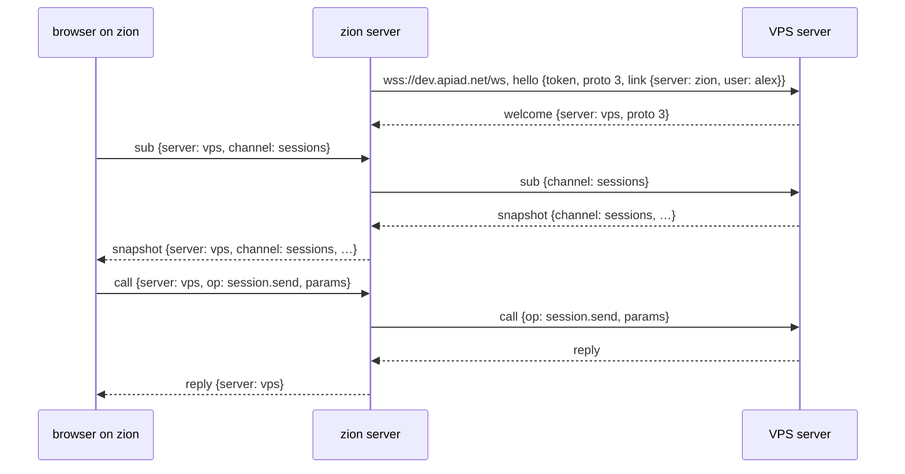

# aegis links: zion uses the VPS, and nothing comes back

**Status: built, 2026-10-08** (issue #203), following
`docs/superpowers/plans/2026-10-08-aegis-links.md`. Where the build changed the
design, this file says so in place. Designed with
Alex in one brainstorm, with mockups over the real client. The mockups and the
scripts that made them are in the workspace playground, not in this repo:
`.playground/aegis-multi-server/build.py` builds `mockups.html` from the live
client's DOM (`capture.py`) and CSS.

This is slices 4 and 5 of the vision (`2026-10-05-aegis-2-vision-design.md`:
home server and links, then messages and handoffs across a link). It changes
the vision in two places, both on purpose, and says so where it does: agents
never spawn across servers, and a linked server can never reach the server
that linked it.

## What this delivers

Alex works on zion and on the VPS. After this work:

- zion's browser shows the VPS's sessions next to zion's own: a VPS band and its
  cards in the Fleet, VPS tabs in the tab bar with a `vps` tag. He reads, prompts,
  interrupts, stops and closes them from zion, as if they were local.
- He spawns on the VPS from zion: from the new-tab view, whose directory line
  names the server (`vps : /home/apiad/Workspace`), or by typing
  `/spawn opus@vps rerun the failed import` in any composer.
- An agent on zion hands work to an agent on the VPS:
  `peer_handoff(target="knuth@vps", context=…)`. It arrives in knuth's inbox as
  `> from agent:lucid-river@zion (alex) · …`.
- Nothing on the VPS can reach zion: no VPS agent, no VPS user, no VPS bug. The
  phone, whose home is the VPS, sees the VPS and never zion.
- The archive lists every server's closed sessions in one list, and pages, so
  all of them can be reached. Today only the newest 50 can (#203).

The typical day this is for: Alex spawns `knuth@vps` from zion's browser, then
tells a zion agent "explain the problem to knuth@vps", or types
`/spawn opus@vps please do this` himself. Results come back through Alex
reading the VPS tab, or through the PR the VPS agent opens.

## Decisions

| Question | Decision | Why |
|---|---|---|
| Who uses it in this version | Alex alone: one person, two servers. The wire carries a `user` from day one | Per-user tokens and per-user quota are a later spec. A `user` field now means that spec changes no protocol |
| What a token is | A token stands for a user. The default token belongs to the Linux user who ran `aegis` | Alex: so later tokens can be minted per person, and quota counted per person |
| What sits in front of the VPS | Nothing but the token. #191 removed Caddy's basic auth, and dev.apiad.net has answered to the token alone since 2026-10-08 | Alex: design for a token-only aegis |
| What a link is | zion acting as one more websocket client of the VPS, holding the VPS's token | The VPS then needs no new trust: it only answers calls and sends patches for channels zion subscribed to, as it does for a browser. A server-to-server protocol would be a second thing to secure |
| Which way a link carries traffic | One way. zion calls and subscribes; the VPS answers. A frame the VPS starts is dropped | Alex: "Yudi cannot, under any circumstance, run code on my laptop" |
| Who may spawn across a link | People only, from zion's client. Agents never spawn on another server, and never enqueue there | Alex, simplifying the vision's rule. An agent that wants work done on the VPS hands it to an agent a person started there |
| Who may message across a link | A zion agent may hand off to a VPS session. No VPS agent can address zion at all | The VPS has no route to zion: it does not know zion exists |
| Can a zion agent read the VPS | It sees VPS handles and states in `session.list`, and nothing else: no titles, no `peer.read` | Reading pulls VPS-written text into the zion agent, the same as a message the VPS pushed. One rule with no exceptions: aegis never carries text written on the VPS into a zion agent |
| Can the phone see zion | No | The VPS would need authority over zion to proxy it, which is exactly what the link withholds |
| How the home server proxies | At the message level: a `server` field on browser messages, routed down the link without it, stamped on everything that comes back | Mirroring remote sessions as local objects would keep two copies of every fact; connecting the browser to each server would put several tokens in the browser |
| Where links are kept | `.aegis/state/links.json`, mode 0600 | Workspace's `.aegis.yaml` is in git and the VPS reads the same file: a `servers:` block there would publish the token and make the VPS link to itself |
| A server's name | Its hostname, overridable with `aegis serve --name` | Both are already in `welcome`. Tests run two servers on one host and need two names |
| A handoff to a server that is down | Fails at once, naming the server | A message queued where nobody can see it is worse than an error the agent can act on (arm a monitor, retry) |
| Fleet layout | Stacked: zion's band and cards, then the VPS's band and cards | Alex chose it from three mockups. It changes today's Fleet least and still reads at three servers |
| Telling servers apart | A small `vps` tag after the handle, on tabs, archive rows and anywhere else a session is named | Alex chose it from three. Tab order stays free, and tags never run out the way colours do |
| Picking the server for a new session | The new-tab view's directory line names it: `vps : /home/apiad/Workspace` | A directory exists on one machine only, so the server and the directory are one choice |
| The archive | One list for every server, below every server block, newest first, with a server filter and "Show 50 more" | Alex asked how the two archives are told apart and paged |
| Who merges archive pages | zion, in Python, with one opaque cursor | DESIGN.md: Python decides, the browser draws. The merge's edge cases are testable there |
| The protocol version | 2 becomes 3 | `hello` gains `link`, browser messages gain `server`. A mismatch says which version each side speaks and nothing half-works |

## The trust model

### The rule, in one sentence

**A link lets zion use the VPS, and lets nothing on the VPS reach zion.**

| | zion to VPS | VPS to zion |
|---|---|---|
| A person in zion's browser sees, prompts, interrupts, stops, closes and reopens VPS sessions | yes | no |
| A person spawns on the other server (`/spawn opus@vps`, the new-tab view) | yes | no |
| An agent spawns or enqueues on another server | no | no |
| An agent hands off to an agent on another server | yes | no |
| An agent lists the other server's sessions | handles and states only | no |
| An agent reads the other server's transcripts | no | no |
| A browser homed on that server sees the other server | yes | no |

### Why it holds

The link is a websocket that zion opens to the VPS and that only zion writes
requests on. The VPS sends five kinds of frame down it: `welcome`, `reply` to a
call zion made, `snapshot` and `patch` for a channel zion subscribed to, and
`error`. zion's link client handles those and drops any other frame with a
log line. There is no operation the VPS could call on zion, because zion runs
no request handler on a link.

A VPS agent addressing `x@zion` fails on the VPS: the VPS has no link named
`zion`, because links are outbound and the VPS opened none. If someone later
links the VPS to zion, that is a second, separate link, opened from the VPS
with a zion token, and it would need Alex to hand the VPS a zion token. Nothing
in this design does that.

### The gap a protocol cannot close

The rule stops Yudi's tokens and Yudi's agents from talking to zion. It does
not stop Yudi from steering one of Alex's VPS sessions, whose output then
reaches zion another way:

- Yudi prompts or configures Alex's VPS session. Today any person on a server
  can, because people can do anything.
- Yudi's agents write files that Alex's VPS session reads. Every session on the
  VPS runs as the same Linux user and shares the checkout, `~/.claude/CLAUDE.md`,
  skills and hooks.
- A zion agent fetches a branch that a steered VPS session pushed. Code moves by
  git, so this is code that runs on the laptop.

Only per-user isolation on the VPS closes these: each person's sessions run as
their own Linux user, or in their own sandbox, and only a session's owner may
write to it. That belongs to the multi-user spec.

**Precondition for a second user:** no second person gets a token on a server
that anyone has linked to, until sessions on it are isolated per user and only
a session's owner can prompt, configure, interrupt or close it. In this version
Alex is the only user, so the precondition holds.

## How a link works



### The link client

One per entry in `links.json`, started at boot and when a link is added. It:

- opens `wss://<host>/ws` with no `Origin` header and says `hello` with the
  linked server's token and `link: {server: <own name>, user: <own user>}`;
- checks `welcome`: the protocol must equal its own and the name must equal the
  one recorded when the link was added, else the link is marked
  `mismatch` with both values and stays down;
- carries every browser's subscriptions on one socket. Each forwarded
  subscription has a link-unique `sid`, and on a link socket the VPS keys
  subscriptions by `sid` instead of by channel name, so two browsers watching
  the same channel get their own numbered patches. Changed from the first draft,
  which subscribed once and fanned out: that needed a cache of each channel's
  snapshot and patches, and the link cannot apply a channel's patches without
  knowing its format;
- reconnects with backoff from 1 s to 30 s after a drop. Subscriptions do not
  survive a drop: the `links` channel tells each browser the link is back, and
  the browser resubscribes with the revision it holds (`since`), as it does when
  its own socket reconnects, so a reconnect costs what changed;
- answers a browser's call to a down link with `server_offline`, naming the
  server and how long it has been down.

### What the VPS does with a link socket

- **Origin.** Browsers always send `Origin` on a websocket, so a socket with
  none comes from a program. The VPS accepts it if `hello` carries `link`. The
  token is still required. A socket with an `Origin` keeps today's rule.
- **Who is calling.** A link socket is a person's socket: `Caller("user")`,
  with `user` from the token (the token's owner; in this version the server's
  only user) and `via` set to the link's server name. Every action it takes
  records `alex via zion`.
- **What it refuses.** `file.open`, which runs an app on the server's desktop,
  is for a browser on that desktop and never for a link.

### Routing on zion

- A browser message with no `server`, or with zion's own name, goes to zion's
  registry as today.
- A message naming a linked server goes down that link with `server` removed.
  Everything that comes back for it gets `server` added before it reaches the
  browser.
- A message naming an unknown server fails with `unknown_server`.
- The browser keys its state by server and channel: `vps` and
  `transcript:<log_id>` is a different key from zion's.

### Links on disk

`.aegis/state/links.json`, written by write-then-rename with mode 0600:

```json
{"links": [{"name": "vps", "url": "https://dev.apiad.net", "token": "…", "added": "2026-10-08T22:10:00Z"}]}
```

- `aegis link add <name> <url>` reads the token from stdin, connects once,
  checks that the server's `welcome` names itself `<name>`, and writes the
  entry. `aegis link remove <name>` and `aegis link list` (names, URLs, state;
  never tokens) do the rest. Settings calls the same code through
  `link.add`, `link.remove` and `link.list`, operations for people only.
- zion refuses a link whose name is zion's own, or another link's.
- The token never appears in `.aegis.yaml`, a log line, a channel or a reply.

### Server names

`aegis serve --name <name>` sets the server's name; without it, the hostname.
The name goes out in `welcome` and is the `@server` part of an address. It is
not stored by the server itself, so renaming a server is restarting it with
another `--name` and re-adding its links elsewhere.

## Agents across a link

### Handoff

`peer.handoff` takes `target` as today. A target of `handle@server`, where
`server` is a link, does this:

1. zion calls `peer.deliver` down the link with the sender's handle, zion's
   name, the user, the context and `interrupt`.
2. The VPS delivers it to the session named `handle` through its inbox, under
   the header `> from agent:<handle>@<server> (<user>) · <iso time>`, held while
   the session works, as every inbox message is.
3. The reply to zion's agent is the VPS's answer: `landed at knuth@vps` or
   `held for knuth@vps`.

`peer.deliver` is an operation only a link socket may call, so an agent on the
VPS cannot call it and a browser cannot either. `interrupt=true` works as it
does locally: the VPS cuts the target's turn, then delivers. Whether an agent
should interrupt a session it did not start is a question for local handoffs
too, and is tracked in #206.

`handle@<own name>` means the caller's own server, the same as a bare handle.

### What else agents see

- `session.list` adds an entry per open session on each linked server that is
  up: `{"handle": "knuth", "server": "vps", "state": "working"}`. No title, no
  cwd, no worker: a title is text the VPS agent wrote.
- `peer.read`, `session.spawn` and `queue.enqueue` with a target on another
  server fail with `not_across_links` and a message that states the rule, so the
  agent knows to ask Alex instead of retrying.
- The priming that tells agents about aegis (`mcp.py`) gains two sentences:
  `handle@server` reaches an agent on a linked server by handoff only, and
  nothing on a linked server can reach you.

### Against a hostile far server

Changed in review: the first build passed the far server's handoff reply, its
error messages and its session handles to the zion agent as they came. A far
server that is compromised could then write into a zion agent's context. zion
now composes every string an agent sees: a handoff reply is `landed at` or
`held for` plus the address the zion agent gave; an error is worded here from an
allowlist of codes (`no_session`, `archived`, `server_offline`, `timeout`), and
any other is `far_error` with no far text; a session list entry is kept only if
its handle passes `valid_handle` and its state is one of four. And only a socket
with no `Origin` may say it is a link, so a browser on the VPS cannot forge a
handoff from zion; a sender's handle and user are checked so no header line can
be forged inside them.

### Why not more

A zion agent that could read VPS transcripts would carry VPS text into its own
context; one that could spawn on the VPS would spend the VPS's quota on its own
judgment. Both make the security sentence longer, and Alex is already looking
at the VPS tab. The handoff covers the case he asked for: "explain the problem
to knuth@vps".

## What a person sees

Every item below is drawn in the mockups.

### The Fleet

- One band per server, zion first, then each link in the order it was added.
  zion's band says `this server`. A link's band says its host, `linked`, and the
  round trip (`dev.apiad.net · linked · 38 ms`), and carries that server's
  counts, host meters and quota.
- Each server's cards sit under its band.
- Alt+J, which jumps to the session that has waited longest for you, and the
  "needs you" notifications span every server.
- Quota: if a linked server reads the same account as a band above it, its band
  shows `same account as zion` instead of the gauges. Each provider's reading
  carries `account`, a short hash of the account id it read, never the address
  itself. The link reads the VPS's quota channel, which the VPS polls anyway,
  so linking adds no poller against the usage endpoint.

### Tabs

- One tab bar. A tab is a server and a log id, and its URL hash is
  `#s=vps/<log_id>` for a remote tab; local tabs keep `#s=<log_id>`.
- A remote tab shows its title and handle as today, then a small tag with the
  server's name.
- The VPS's open sessions are the VPS's tabs, shown to every browser homed on
  zion and to the phone. Closing one from zion closes it everywhere.
- Tab order stays private to each browser, mixes servers, and keeps a remote
  tab's place across reconnects.
- The bar already overflows: at 1440 px six of Alex's real tabs truncate every
  title, and VPS tabs would fall off the end. The tab list scrolls sideways, a
  tab gives up its title before its handle and its handle before its tag, and the
  focused tab is scrolled into view. Alt+1 to 9 counts over the whole bar.

### Reading, recaps and sent files

- Reading a VPS session from zion marks it read on the VPS, so the phone sees
  it read. A recap is asked of the VPS and runs on its Claude Code.
- A VPS agent's `file_send` URL is relative to the VPS. Through zion the client
  rewrites it to `/via/vps/files/<id>/<name>`, which zion streams from the VPS.
  The 128-bit id stays the secret. Changed in review: the first draft passed the
  VPS's headers through, and a hostile VPS could then serve HTML with no
  sandbox on zion's origin, where its script holds the cookie. zion now decides
  every header from the file's name, as for its own files, and the client builds
  every link on a far file card from a `/files/<id>/<name>` path, never from a
  URL the far server sent. Open natively is refused for a remote file.

### Spawning

- **The new-tab view.** The line above the box reads `zion : /home/apiad/Workspace`
  when at least one link exists, and `/home/apiad/Workspace` when none does.
  Clicking it picks a server and a directory together. Picking `vps` reloads the
  agent, model and permission choices from the VPS's `agents.list`.
- **`/spawn`**, an aegis command for people, in any composer:
  `/spawn <agent>[@server] [prompt] [--model m] [--effort e] [--cwd path]`.
  It spawns, opens the new tab without focusing it, and leaves the composer
  empty. With no `@server` it spawns on the server of the tab it was typed in.
  It records no `spawned_by`: a person's spawn is nobody's child.
  It fails in place, before anything starts, on an unknown agent
  (`no agent named ghost on vps (opus, sonnet, haiku)`) and on a link that is
  down (`vps is offline since 21:40; nothing was started`).
  It comes back from the legacy tree's command of the same name, with `@server`
  and `--cwd` added.

### Settings

- A Servers section: this server's name, then each link with its URL, state
  (`linked · 38 ms`, `offline since 21:40`, or `protocol 2, this server speaks
  3`), version, and Remove. Below, a URL field, a token field and Link.
- A server picker at the top of the agents and config editor switches it to a
  linked server, so the VPS's `.aegis.yaml` is edited from zion through the same
  `config.*` operations.

### When the link is down

- The band says `offline since 21:40 · retrying in 30 s` and greys its gauges.
- The server's cards and tabs grey out and keep their last snapshot, readable.
  A remote tab's composer is disabled with the reason.
- On reconnect everything resubscribes with `since` and comes back without a
  reload.

## The archive

One list, below every server block.

- **Rows.** Newest first across servers. A row's handle carries its server's
  tag. Read opens the stored transcript from the row's server; Reopen reopens it
  there, and its tab appears with the tag.
- **Filter.** Next to the search: `All 133 · zion 110 · vps 23`. The search text
  goes to every server, and each filters its own archive.
- **Paging.** "Show 50 more" under the last row, with `Showing 50 of 133`. A
  button, never infinite scroll: DESIGN.md forbids a page that grows without a
  person asking it to.
- **The operation.** `archive.list` takes `query`, `server` (optional), `limit`
  and `cursor`, and returns `{items, total, counts: {server: n}, cursor}`;
  `cursor` is null on the last page. Called on zion, it asks each server for
  `limit` items after that server's position, merges them by last activity,
  returns the first `limit`, and encodes each server's new position in the
  cursor. The cursor is opaque to the client.
- **The position** is `(last_activity, log_id)`, compared as a pair. Today's
  `before` is a bare timestamp compared with `>=`, which skips a session sharing
  its timestamp with the last row of a page (`registry.py:377`).
- **A server that is down** contributes nothing, and the filter shows
  `vps offline` in place of its count, so its rows are visibly missing and not
  silently gone.

## Failure and edge cases

| Case | What happens |
|---|---|
| The link drops mid-turn of a VPS session | The session keeps running on the VPS. zion greys it; on reconnect the delta brings the turn |
| zion restarts | Links reconnect at boot from `links.json`; browsers resubscribe as today |
| The VPS restarts | The link reconnects; VPS sessions come back stopped, as on the VPS itself |
| Protocols differ | The link stays down, marked `mismatch`, both versions shown. Upgrade both |
| The VPS answers with another name than the link's | The link stays down: `this server calls itself lab, the link expects vps` |
| A handoff to a server that is down | `server_offline` at once, with how long it has been down |
| A handoff to a handle the VPS does not have | The VPS's own `no_session` error, prefixed with the server |
| The VPS sends a frame zion did not ask for | Dropped and logged once per kind |
| Two browsers watch the same VPS channel | Two subscriptions on the one link socket, each with its own `sid` |
| A token is revoked on the VPS | `hello` fails with 4401; the link is marked `unauthorized` and stops retrying until the token is replaced |

## Slices

Each is usable on its own, in this order.

0. **Archive paging on one server.** The `(last_activity, log_id)` position, the
   new `archive.list` response, "Show 50 more", the filter's total. Fixes
   today's 50-session ceiling. No link involved.
1. **A link a person can use.** `--name`, `links.json`, `aegis link
   add|remove|list`, the link client with backoff and resubscribe, protocol 3,
   link sockets on the VPS, routing on zion, the stacked Fleet, tags on tabs,
   the scrolling tab bar, remote transcripts with read, send, interrupt, stop,
   close and reopen, the offline and mismatch states. After it, Alex drives his
   VPS sessions from zion.
2. **Spawning and the rest of a person's work.** The server in the new-tab
   directory line, `/spawn` with `@server`, the Servers section and the config
   editor's server picker, sent files through `/via/<server>/files/`, the
   merged archive across servers, `same account as zion`.
3. **Agents across the link.** `peer.deliver`, `handle@server` in
   `peer.handoff`, linked servers in `session.list`, `not_across_links` for
   `peer.read`, `session.spawn` and `queue.enqueue`, the priming's two
   sentences.

## Testing

- **Two real servers.** A fixture starts two `aegis serve` processes on
  temporary roots and ports with `--name alpha` and `--name beta`, both running
  `tests/fake_claude.py`, and links alpha to beta through `aegis link add`. The
  browser tests drive alpha's page.
- **The person's path** (slices 1 and 2): beta's sessions appear in alpha's
  Fleet under a beta band; a prompt typed in a beta tab on alpha lands in
  beta's store; `/spawn opus@beta` creates the session on beta; killing beta
  greys its band and cards, and restarting it brings them back with no reload;
  the merged archive pages through 120 sessions split across both servers with
  no row twice and none missing, including sessions that share a timestamp.
- **The rule, attacked.** Each of these must fail the way the trust model says:
  - beta writes a `call`, a `sub` and a made-up frame down the link. alpha runs
    nothing and logs the drop.
  - A beta agent hands off to `x@alpha`, calls `session.list`, and finds no
    alpha in either.
  - An alpha agent calls `peer.read`, `session.spawn` and `queue.enqueue` on
    beta and gets `not_across_links`.
  - A browser socket on beta tries `peer.deliver` and is refused.
  - A marker string written into a beta session's transcript and title never
    appears in anything alpha's fake claude reads on stdin, across a handoff, a
    `session.list` and every refused call. To prove this test can fail, the
    first run adds titles to `session.list` on purpose and watches it go red.
- **The handoff** (slice 3): an alpha agent hands off to a beta session; beta's
  fake claude receives one user turn with the header naming the alpha sender,
  alpha's server and the user. With `interrupt=true` and beta's
  session mid-turn, beta's turn is cut first, then the message lands.
- **Live** (`make test-live`): one real Claude Haiku on alpha hands off to a
  session on beta, and beta's transcript shows the header.
- **Bench.** `make bench` gains one row: a transcript replayed through a link,
  against the same transcript locally, to measure what the extra hop costs per
  line.

## Deploying

1. **Precondition, met:** #191 is merged and deployed, so dev.apiad.net answers
   to the token alone. A socket still proves the token in its `hello`, which is
   what a link does, and Caddy passes `/ws` and blocks only `/mcp`, so the link
   needs no Caddy change.
2. Release with protocol 3, then upgrade zion and the VPS to the same version
   (`know-how/releasing.md`; the VPS redeploy is in the workspace memory for
   dev.apiad.net). Until both are upgraded the band shows the mismatch.
3. Link once:
   `ssh vps cat ~/Workspace/.aegis/state/token | aegis link add vps https://dev.apiad.net`.
   The token travels from the VPS's file into zion's `links.json` without
   entering a shell history or `.aegis.yaml`.

## What DESIGN.md gains

- The process model's "Later slices add the home server…" sentence becomes a
  paragraph: one process per machine, and a server may hold links, outbound
  sockets to other servers that it uses as a client.
- A rule that spans modules: **A link is a client, and nothing travels from a
  linked server into an agent.** With its reason (Alex's laptop never runs what
  someone else's token wrote), its mechanism (the link client handles five frame
  kinds and runs no request handler) and its test.
- "Agents change only what they created" gains: and never spawn, enqueue or
  read on another server.

## Out of scope

- Relaying between links, and a server linking back to the one that linked it.
- Per-user tokens, quota per user, and per-user isolation on a shared server
  (the multi-user spec; see the precondition above).
- Moving a session between servers (#119). Work moves by handoff and git.
- A machine joining by recipe (#152). Linking is one command once a server runs.
- Anything an agent on a linked server can do to the server that linked it. There
  is nothing, by design.
