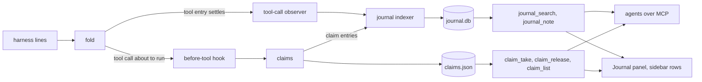

# aegis: a journal of what was done, and claims over the paths being worked on

**Status: design approved in conversation, 2026-10-10** (issues #289 and #290).
Designed with Alex in a brainstorm in a session tab. Not implemented. The
implementation plan comes next, under `docs/superpowers/plans/`.

## What this delivers

Two features that read the same thing: the tool calls aegis already folds from
every harness.

**The journal.** aegis keeps a record of what was done on this server: commits,
pull requests, finished plan items, turns that changed files, and the decisions
and blockers agents note. An agent asks it "what did we do on 2026-10-09" or
"what touched `repos/aegis/src/aegis/client/` last week" with one tool call, and
a person asks the same in a Journal panel. Agents stop writing journal lines by
hand: in the week of 2026-10-03 to 2026-10-09 they wrote 365 of them into
`vault/Calendar/Journal/`, and most restated a commit or a `turn_end` line that
aegis already held. The vault journal retires.

**Claims.** An agent working in the shared checkout claims a path prefix, such as
`repos/enciclopedia/`, with a line saying what it is doing there. Another
session whose tool call enters that subtree is told, once and in that tool call,
who holds it, whether they are still active, and that it should coordinate. If
it writes there, the holder is told too. Nothing is ever denied. Worktrees are
exempt because a worktree lives at another path. Claims replace the workspace's
`bin/ws-lock`.

## Decisions

| Question | Decision | Why |
|---|---|---|
| Who the journal is for | Any aegis user, as a product feature | aegis is on PyPI; a journal that knows one vault's layout would be rewritten when it becomes a plugin |
| Where it lives | `<state>/journal.db`, not the vault | Alex, 2026-10-10: the vault journal retires; agents query aegis |
| Source of truth | The transcript stores. The journal is an index derived from them | Follows "the store keeps raw lines; entries are derived". A bug in derivation is fixed by `aegis journal rebuild`, and the rebuild backfills to the day aegis 2 started |
| Storage | SQLite (stdlib), WAL, FTS5 over entry text | A path or date query over JSONL would scan every line |
| Who writes entries | aegis derives them; agents add only decisions, blockers and milestones with `journal_note` | Commits and finished work are most of today's hand-written lines, and aegis already sees them |
| What "touched" means | Writes and commits only, never reads | A read is not a change; storing reads would multiply the rows about tenfold and bury the writers |
| Claims: block or notify | Notify only | Alex: other agents "get notified that they should coordinate". A deny is routed around within one turn |
| Claims: what counts as entering | Any tool call whose path falls under the prefix, reads included | An agent that reads for twenty minutes before writing has planned around code someone else is rewriting |
| Claims: who is told | The newcomer on its first touch; the holder on each newcomer's first write | A notice to the holder on every read interrupts it for nothing |
| Claims: when they end | On release or when the holder's session closes. No timer | A timer drops the claim of a session waiting on a monitor. An idle holder is shown as dormant instead, and a person can clear any claim |
| Claims: which path | The real path, after symlinks and `..` | The journal maps worktree paths onto the main checkout; claims must not, or the worktree exemption disappears |
| How it is built | In core now, as two packages shaped as plugins | The plugin runtime is slice 6 of the aegis 2 vision and does not exist yet. Shaping them as plugins makes them two of its test cases, claims exercising the synchronous hook |
| Order | Hook spike, then the journal, then claims | The journal needs only the after-tool hook. Claims need the synchronous hook, which #285 found but nobody has run end to end |
| Sessions outside aegis | Not covered | Alex, 2026-10-10: bare `claude -p`, the job substrate and every other path outside aegis are being retired in favour of aegis |

## How it fits

Core gains one seam, the **tool-call observer**: a subscriber receives each tool
entry once its status settles to `ok` or `err`, in the shape the fold already
produces for every harness (`kind: "tool"`, `title`, `status`, `detail` with
`path` for file tools; see `transcript/entries.py` and `transcript/describe.py`).
No new parser is needed for Claude Code, OpenCode or Codex.

`src/aegis/journal/` and `src/aegis/claims/` reach the rest of aegis only through
the four contributions the vision lists for a plugin: operations in the one
registry, a state channel, a panel renderer, and hooks (the observer for both,
the before-tool hook for claims). When the plugin runtime lands, each package
moves into it without a new seam.

## The journal

### Records

`journal.db` holds two tables:

- `entries`: `id`, `ts`, `log_id` (the session), `handle` (at that moment),
  `repo`, `kind`, `tag`, `text`, and `source` (the transcript's log id and the
  entry id inside it).
- `touches`: `entry_id`, `repo` (the main checkout, or null outside a repo),
  `path` (relative to the repo root, or absolute outside a repo), `op`
  (`edit`, `write`, `commit`, `bash-write`).

An FTS5 index covers `entries.text`. `touches` is indexed on `(repo, path)`, so a
prefix query is a range scan.

### Entry kinds

| kind | derived from | text | touches |
|---|---|---|---|
| `turn` | a turn that wrote files, or ended with `turn_end` `done` or `review` | the `turn_end` line, else the first 120 characters of the turn's prompt | every file written in the turn |
| `commit` | `git commit` output in a Bash result | subject, short hash and branch | the commit's files |
| `pr` | `gh pr create` or `gh pr merge` output | title and URL | none |
| `plan` | a plan item turning `done` | the item | none |
| `note` | a `journal_note` call | the note, with its `tag` | the paths the agent passed |
| `session` | spawn, rename, close | "spawned by X in cwd", "renamed to Y", "closed" | none |
| `claim` | claim taken, entered, released or cleared | who, which prefix, the claim's line | none |

Single edits are touches of their turn, never entries of their own, so the
timeline stays readable.

### Commits

Git prints `[branch 1a2b3c4] subject` on commit (and `[branch (root-commit)
1a2b3c4]` on the first). A regex finds the line in the Bash result. The repo is
taken from a leading `cd X &&` or `git -C X` in the command, else from the
session's working directory. The indexer runs
`git show --name-only --format= <hash>` there for the file list. If the hash is
not in that repo, because a `cd` earlier in the session moved the shell, the
entry is kept with no touches and `files_unknown` set. Commits are immutable, so a
rebuild gets the same file list as long as the repo exists.

### Paths

A touch names the repo by its main checkout (the parent of
`git rev-parse --git-common-dir`) and the file relative to the repo root. An edit
in `.claude/worktrees/fix-x/src/aegis/app.py` and one in `src/aegis/app.py` of the
main checkout are the same file to the journal. A query path is resolved the same
way before it is matched.

### Writes made through Bash

Best effort, as in the 2026-08-07 claims spec: redirect targets (`>`, `>>`),
`tee`, `sed -i`, and the destinations of `mv` and `cp`. Relative paths resolve
against the same working-directory guess commits use. A command that does not
parse makes no touch. A file written that way and committed later is still
found through the commit.

### Live and rebuilt

The live path and `aegis journal rebuild` call one derivation function over the
same records. The rebuild drops `journal.db` and walks every store, archive
included. Old vault journals are not imported; they stay in git.

### Operations

**`journal_search`**, every filter optional and combined with AND:

- `since`, `until`: a date (`2026-10-09`) or a span (`7d`, `yesterday`). Days are
  the server's local days.
- `pattern`: FTS5 over entry text (words, quoted phrases, `OR`).
- `path`: a prefix, repo-relative (`repos/aegis/src/aegis/client/`) or
  absolute. Matches through touches.
- `session`: a handle or a log id. Renames are `session` entries, so an old
  handle finds the session.
- `repo`, `kind`.
- `limit`, default 50.

The result is text grouped by day, newest first. A row has the time, handle, kind
and text, up to three touched paths and a `+N more` count, and the `source`
pointer that `peer_read` takes to show the surrounding turn. The last line gives
the count and says whether the limit cut it.

**`journal_note`**: `text`, `tag` (`decision`, `blocker`, `milestone`), optional
`paths`. It writes nothing itself; the call is the record and the indexer picks
it up like any other tool call, so a rebuild sees it.

The priming text gains one line: record decisions, blockers and milestones with
`journal_note`; commits and finished work are journaled for you.

`aegis journal search` and `aegis journal rebuild` on the CLI call the same code.

### What a person sees

- **Journal panel.** A filter bar (text, path, session, kind, a day picker) over
  that day's rows. It is a renderer for a `journal` channel; the search runs in
  Python through `journal_search`, so a person and an agent asking the same thing
  get the same rows. A row opens its session's transcript at the entry.
- **Sidebar.** One `.prow` per session, "Journal · 12 today", whose `.pcard`
  (hover or focus on a desktop, tap in the drawer, as `js/side.js` does for every
  row) lists the session's last entries. Each opens in the Journal panel.

## Claims

### Operations

- `claim_take(paths, desc)`: registers path prefixes. It returns the claims that
  already overlap them in either direction (a parent or a child prefix). The
  claim is granted anyway.
- `claim_release(paths)`: ends the caller's claims on those prefixes; with no
  paths, all of them.
- `claim_list`: every live claim, with holder, state and idle time.

An agent releases only its own claims ("agents change only what they created").
A person can clear any claim from the client.

### Entering

A tool call enters a claim when one of its paths, resolved to the real path,
falls under a prefix held by another session. Its paths are:

- the `path` in the fold's `detail` for Read, Edit, Write and NotebookEdit;
- the `path` argument of Grep and Glob;
- for Bash, best effort: a leading `cd X`, absolute paths in the command, and the
  working-directory guess.

Notices:

- **The newcomer**, once per claim per session, on a read or a write:
  `repos/enciclopedia/ is claimed by enciclopedia-ch4 (working, active 3 min
  ago): rewriting tomo 2. Coordinate with peer_handoff, or read it with peer_read,
  before changing files here.`
- **The holder**, once per newcomer, on that newcomer's first write:
  `aegis-journal-locks wrote repos/enciclopedia/tomo2/cap4.md inside your claim.`

### Delivery

The inbox delivers when a turn ends. That is too late for a newcomer, which may
have edited ten files by then. Each session keeps a queue of pending notices,
and its next tool call carries them as context through the harness's hook:

- **Claude Code**: `PreToolUse` and `PostToolUse` registered through
  `hook_callback` in the stream-json `initialize` request, answering with
  `additionalContext`. The spike below confirms it.
- **OpenCode**: its plugin's `tool.execute.before`, injected through
  `child_config`. Unchecked.
- **Codex**: unknown.

Until a harness's hook is verified, its notices fall back to the inbox at turn
end. An idle holder is not woken; its notice waits for its next turn.

### Dormant holders

A holder is dormant when its session is stopped, or has not been working for 30
minutes. The newcomer's notice says which and for how long, and the newcomer
decides.

### What a person sees

- **Sidebar.** A `.prow` per claim the session holds or has entered:
  `🔒 enciclopedia/ · ch4`, dimmed when dormant. Its `.pcard` opens on hover like
  every sidebar row: the full path, the line, the holder's state and idle time,
  who has entered, and Release (own) or Clear (anyone's, for a person).
- **Fleet.** A session holding claims gets one small chip on its card, nothing
  more.

### Storage

Live claims are in `<state>/claims.json`, written by write-then-rename, so boot
still reads no store. Each take, entry, release and clear is also a `claim` entry
in the journal.

## Delivery

1. **Spike, throwaway.** Register `PreToolUse` and `PostToolUse` through
   `hook_callback` with the installed Claude Code; check that the callback
   arrives, that `additionalContext` reaches the model, what it adds to each
   tool call's latency, and whether a subagent's tool calls fire it. Findings go
   on #285.
2. **Journal PR** (#289): the observer, the indexer, `journal.db`, rebuild, the
   two operations, the CLI, the priming line, the panel and the sidebar row.
3. **Claims PR** (#290): the operations, `claims.json`, delivery through the
   hooks with the inbox fallback, the sidebar rows, the Fleet chip, `claim`
   entries.
4. **Workspace migration**, after Alex has smoke-tested each PR, in the Workspace
   repo: the files that read or write the vault journal (13 on 2026-10-10,
   including the end-of-day, morning-briefing and standup jobs, `/onboarding`,
   `/handoff`, `/evening-journal` and `bin/ws-scan`) move to
   `aegis journal search` or are retired with the job substrate; the journaling
   section of CLAUDE.md shrinks to the `journal_note` line; `ws-lock` and its
   skill retire once claims ship.

## Testing

Tests drive real sessions with the fake claude, as the repo prefers. The ones
that hold the design:

- a live session's journal equals `aegis journal rebuild` over its store;
- a commit made in a worktree is found by a path query on the main checkout;
- a commit whose hash is not in the guessed repo is kept with `files_unknown`;
- `journal_note` lands as a `note` entry, and survives a rebuild;
- a renamed session is found by its old handle;
- a claim on the main checkout does not fire for an edit in a worktree;
- a read under a foreign claim notifies the newcomer once, and a second read
  does not;
- a write under a foreign claim notifies the holder once per newcomer;
- a claim ends when its holder's session closes, and shows dormant when it is
  stopped;
- browser: the sidebar rows open their cards on hover, and a journal row opens
  the transcript at its entry.

## Non-goals

- Sessions that do not run in aegis (bare `claude -p`, the job substrate).
- Importing the old vault journals.
- Claims across linked servers. A claim holds on its own server only.
- Denying a write, under any claim.
- Reads in the journal.
- Monitors and queue tasks as journal entries.

## Open questions

- Does `hook_callback` work end to end, and do subagents inherit it? The spike
  answers this before the claims PR starts.
- Can OpenCode's and Codex's hooks carry a notice into the model's context?
- Is 30 minutes the right threshold for dormant? It is a constant to tune after
  a week of use.
